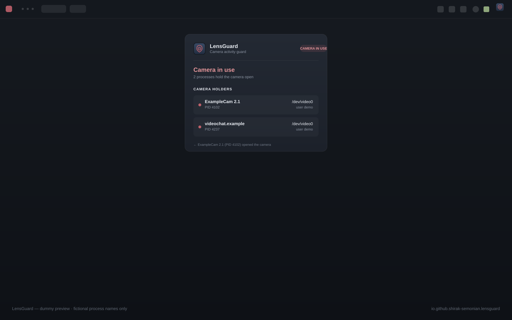

# LensGuard

Camera activity guard for the Omarchy bar. LensGuard watches which process
holds the webcam (`/dev/video*`) open and shows it clearly in the bar:
calm when the camera is idle, yellow when a known app (whitelisted) uses it,
red when an UNKNOWN process opens it — with a desktop notification, a tooltip
that names the process, and a panel with live details, history, whitelist and
settings. Built for people who want to *know* when their webcam is being
used.

> **Privacy first:** LensGuard never opens the camera, records nothing, sends
> nothing over the network and needs no account or API key. It only lists
> which processes hold the video device node open — the same information
> `lsof` exposes locally. State and whitelist stay in your own files
> (`~/.local/state/lensguard/`, `~/.config/lensguard/`).



## Features

- **Webcam watch without privileges** — probes `/dev/video*` with `lsof`
  (machine-readable, primary) or `fuser -v` (automatic fallback); no kernel
  module, no daemon, no root.
- **Clear bar state** — the shield-and-lens glyph is calm navy when the
  camera is idle, yellow for a whitelisted app, red for an unknown process,
  soft orange when detection is unavailable; state changes cross-fade.
- **One alert per unknown open** — exactly one desktop notification when a
  process that is not on your whitelist opens the camera, naming the command
  and PID; whitelisted apps stay calm.
- **Panel with context** — live holder cards (command, PID, user, device,
  since), the last 20 camera events, whitelist management and settings.
- **Local and quiet by default** — no network calls, no account, no API key;
  config and history are plain files in your home directory.

## Why this works

An application that uses the camera keeps the video device node (`/dev/video0`,
`/dev/video1`, …) open for as long as it is in use. That is also true for
browsers: the browser delegates capture to PipeWire, and PipeWire opens the
device on the app's behalf — so LensGuard sees the real camera user, not just
the browser process.

Detection is done with the tools that are already on every Arch system:
`lsof -F` (machine readable, primary) or `fuser -v` (fallback). No kernel
module, no service, no privileged daemon.

## Privacy & security

LensGuard is a local observer, not a recorder:

- **What it sees.** Each poll lists which processes hold a `/dev/video*`
  node open: numeric PID, command name, user and device path — the same
  information `lsof`/`fuser` already print for your own user. It never
  opens the camera, never captures a frame and never records audio or
  video.
- **No network.** LensGuard makes no network calls of any kind: no
  telemetry, no update check, no account, no API key. There is no endpoint
  configuration anywhere in the plugin.
- **Why the whitelist.** Camera use by a whitelisted app is behaviour you
  already expect, so it is shown calmly (yellow bar state, no popup).
  Anything NOT on the list turns the bar red and raises exactly one alert —
  that is the moment LensGuard exists for: an app you have not approved is
  using your lens. Matching is deliberately strict: an entry matches a
  command only at a `-`/`_` boundary or at the exact end (`zoom` never
  matches `zoommalware`), so trusting an app never silently trusts
  lookalikes.
- **Local state.** The whitelist and settings live in
  `~/.config/lensguard/config.json`; the last 20 camera events live in
  `~/.local/state/lensguard/state.json`. Both are written atomically with
  mode 600 (owner-only) and never leave your machine. A config reset keeps
  a `config.json.bak` next to the file.
- **No escalation.** “Investigate” in the panel reads the process’s own
  `/proc/<pid>/cmdline` under your normal user rights. LensGuard never asks
  for elevation and never touches other users’ processes.

## Statuses

The bar glyph is a camera lens inside a security shield on a calm navy tile
(same family as the other Omarchy system-plugin icons). Its colour carries
the state — the optional process name appears next to it while the camera is
in use (`showProcessInBar`, off in `compactMode`):

| Bar glyph | State | Meaning |
| --- | --- | --- |
| Steel shield+lens | idle | No process holds the camera open. |
| Yellow shield+lens | known app | A whitelisted app uses the camera; calm, no alert. |
| Red shield+lens | unknown process | A process NOT on the whitelist opened the camera; LensGuard notifies you once and shows an attention card in the panel. |
| Soft-orange shield+lens | detection unavailable | Tools missing (`lsof`/`fuser`) or no camera device found. LensGuard re-checks calmly every 5 s and recovers automatically. |

State changes cross-fade smoothly (no hard icon pops), and the icon reads on
both light and dark bars because the tile keeps its own contrast.

Click (left/right) toggles the panel: live status + process cards (command,
PID, user, device, since when), the event history and the whitelist. Middle
click forces an immediate re-check.

The first poll after a shell start is a silent baseline: when LensGuard
starts while the camera is already in use it shows the state immediately but
does not ring a false “opened” event. Only transitions that happen while
LensGuard is watching are reported.

## Notifications

When a process that is **not** on the whitelist opens the camera, LensGuard
sends exactly one desktop notification per open (both notification settings —
`notifyOnOpen`, `notifyOnUnknown` — are on by default; see “Whitelist &
settings”):

> **LensGuard: camera opened by `<command>` (PID `x`)**

plus a journal line. Whitelisted apps are calm (yellow “known app”, no
notification). When the camera closes there is no popup — the tooltip quietly
notes who released it.

## Whitelist & settings

Everything lives in `~/.config/lensguard/config.json` (created on first
change, mode 600 from the first byte):

```json
{
  "whitelist": ["zoom", "obs", "teams", "chrome", "firefox", "…"],
  "pollIntervalMs": 1000,
  "notifyOnOpen": true,
  "notifyOnUnknown": true,
  "showProcessInBar": true,
  "compactMode": false
}
```

| Key | Default | Meaning |
| --- | --- | --- |
| `whitelist` | common camera apps | Commands that may use the lens without an alert (calm yellow “known app”). |
| `pollIntervalMs` | `1000` | Probe cadence, clamped to 250–5000 ms. |
| `notifyOnOpen` | `true` | Master switch for the camera-open desktop notification. |
| `notifyOnUnknown` | `true` | When off, unknown opens stay red in the bar/panel but do not pop up. |
| `showProcessInBar` | `true` | While the camera is in use, show the process name next to the icon. |
| `compactMode` | `false` | Icon only — never show text in the bar. |

Missing keys fall back to the defaults automatically. A missing, empty or
broken config simply uses the defaults — the guard never stops. When a file
is broken the panel shows a calm note (never the file content) with one-click
**Reset to defaults**: fresh defaults are written atomically (mode 600) and
the broken file is kept as `config.json.bak`. The same reset is available
over shell IPC (`resetConfig`). All settings are also editable from the
panel's **Settings** section — no JSON editing needed.

Whitelist entries match the process command name: `teams` matches `teams` and
`teams-for-linux`; an unknown process can be added from the panel (“Allow”)
or removed again (“Deny”).

## State

`~/.local/state/lensguard/state.json` (mode 600) keeps the last 20 camera
events and the last status, so the panel shows history across shell restarts.
Restoring it is display-only and never re-alarms (the first poll after a
restart is always a silent baseline).

## Install

```sh
omarchy plugin add https://github.com/Shirak-Semonian/lensguard-omarchy-plugin --enable --yes
omarchy restart shell
```

Manual / development install: copy the folder to the plugins directory, then
enable it and restart the shell:

```sh
cp -r lensguard-omarchy-plugin ~/.config/omarchy/plugins/io.github.shirak-semonian.lensguard
omarchy-shell shell rescanPlugins
omarchy plugin enable io.github.shirak-semonian.lensguard --section right
omarchy restart shell
```

## Uninstall

Disable and remove the plugin, then restart the shell:

```sh
omarchy plugin disable io.github.shirak-semonian.lensguard
omarchy plugin remove io.github.shirak-semonian.lensguard --yes
omarchy restart shell
```

No widget stays running afterwards. To also delete the local data LensGuard
created (whitelist, settings and event history), remove its two data
directories:

```sh
rm -rf ~/.config/lensguard ~/.local/state/lensguard
```

For a manual (folder-copy) install, remove
`~/.config/omarchy/plugins/io.github.shirak-semonian.lensguard`, drop the
widget from the bar layout and restart the shell.

## Requirements

- Omarchy shell (Quickshell-based bar)
- `lsof` or `fuser` (`coreutils`/`lsof` — both ship with Arch by default;
  LensGuard falls back automatically when one is missing)
- A V4L camera device (`/dev/video0` etc.)
- No network, no keys, no account

## Polling behaviour

- Probe cadence follows `pollIntervalMs` (default 1 s, clamped 250–5000 ms):
  one probe in flight at a time, never faster than the configured interval.
- The heartbeat runs at `min(interval, 1 s)` so a fast setting is honoured
  promptly; the tick gate still guarantees no below-minimum polling.
- Every probe runs on a fresh process object; nothing is left behind.
- Every probe is bounded by a 5 s watchdog (kill + rebuild if a probe ever
  hangs), so one wedged probe can never stall the widget.
- In the calm error state (no device / tools missing) the re-check cadence
  drops to once per 5 s.

## Development

```sh
node test-model.js        # unit tests for the detection engine (no deps)
omarchy plugin validate . # plugin manifest validation (exit 0)
```

Layout (same architecture as the other Omarchy widgets by the same author):

- `Model.js` — pure logic shared by the QML and the Node tests: probe script,
  `lsof -F`/`fuser -v` parsers, process-level opened/closed events, whitelist
  matching, config/state parsing (incl. interval clamping + strict settings)
  and notification rules. No shell, no Qt, no Node built-ins.
- `BarWidget.qml` — the compact bar widget: heartbeat, probe lifecycle,
  watchdog, config watcher + settings writes + reset, state-file persistence,
  notification dispatch, state → glyph/tooltip mapping, panel routing.
- `Panel.qml` — the details panel: live status, per-process cards with
  Allow/Investigate, event history, whitelist management and the Settings
  section (interval, notifications, bar text, reset).
- `test-model.js` — plain-`assert` Node tests with synthetic example
  captures (fictional PIDs/users — no machine data).
- `assets/` — icons (idle/known/unknown/error) and the dummy preview.
- `icon-source.svg`, `preview-source.svg` — editable artwork sources.

User-facing text is English. Comments in the code may be Dutch.

## License

MIT © 2026 Shirak Semonian
